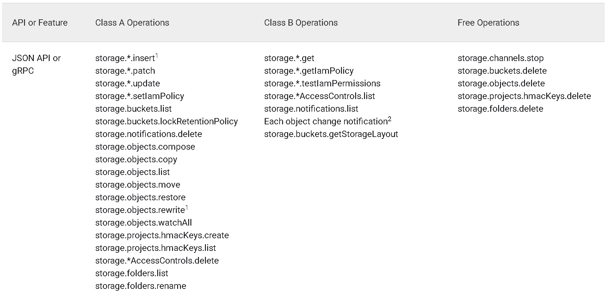
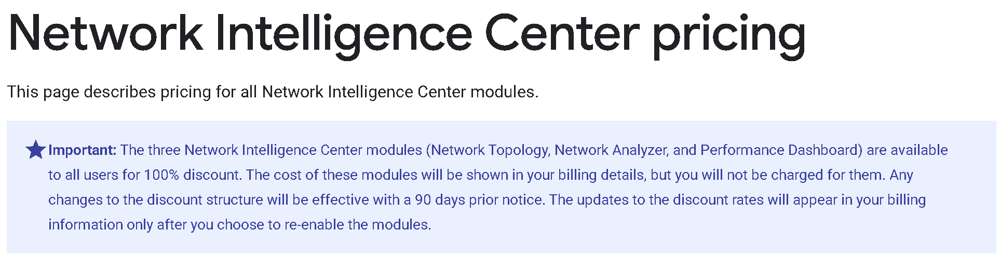

# Cost for Using TPUs

Cost includes storage cost, networking cost, compute engine cost, and other minor costs.

## (1) Cloud storage cost
### (1.1) Bucket cost
The storage cost on buckets is NOT covered by TPU Research Cloud. It is usually the single largest part of TPU usage cost.<br>
The standard cost (usually, one should use single-region buckets instead of dual-region and multi-region ones) can be viewed in the "Data storage" table under https://cloud.google.com/storage/pricing#price-tables.<br>
For a quick estimation, the storage price is around $0.02 / GB / month.

### (1.2) Operation cost
Performing operations within Cloud Storage incurs cost. Class A operations (e.g., uploading files) cost $0.0050 / 1,000 operations, while Class B operations (e.g., accessing files) cost $0.0004 / 1,000 operations. While these operations are cheap, the cost can easily ramp up if, e.g., the image datasets are stored as individual image files rather than `tfrecords`.

Note that `tfrecords` is recommended over `array_record`, because `array_record` incurs a read (Class B) operation at every step, and consequently leads to higher number of Class B operations in total.

Below is the complete categorization of all operations from https://cloud.google.com/storage/pricing.
<p align="center">

</p>

## (2) Networking cost

### (2.1) File transfer
- Local -> bucket transfer
According to the "General network usage" table under https://cloud.google.com/storage/pricing#price-tables, inbound data transfer is free.

- Bucket -> local transfer
According to the "General network usage" table under https://cloud.google.com/storage/pricing#price-tables, outbound data transfer costs $0.1 / GB.

- Bucket -> VM transfer
During model training, data can be streamed from the buckets.<br>
According to the "Data transfer within Google Cloud" table under Data transfer within Google Cloud" table under https://cloud.google.com/storage/pricing#price-tables, **as long as the bucket and the TPU-VM are in the same location**, the data transfer is free.

- Bucket -> bucket transfer
According to the "Data transfer within Google Cloud" tables under Data transfer within Google Cloud" table under https://cloud.google.com/storage/pricing#price-tables,<br>
- If the buckets are in the same location, the data transfer is free.<br>
- If the buckets are in different locations (which may be more common), the data transfer would cost money. For a quick estimation, the transfer cost is $0.02-0.05 / GB.<br>
This means that transfer a 1TB data between buckets would cost at least $20. Thus, if a copy of the data is also available locally, it's advised to upload it from local instead of copy between buckets.

### (2.2) Network Intelligence Center
As you use the TPUs, many monitoring statistics are automatically collected. These "Network Intelligence Center"-related costs (e.g., "Network Intelligence Center Network Analyzer Resource Hours") appear on the cost reports, but are 100% discounted (i.e., practically free) currently. See https://cloud.google.com/network-intelligence-center/pricing.

<p align="center">

</p>

## (3) Compute engine cost
### (3.1) TPU
The usage of TPUs is often covered by the TPU Research Cloud program.<br>
Its standard pricing can be viewed at https://cloud.google.com/tpu/pricing.<br>
For a quick estimation, the price of a TPU v4-8 is $12.88 / hour.

### (3.2) VM instance
The cost of VM is not covered by the TPU Research Cloud. Unless you explicitly specify another type when creating it, the VM instance should be of type `n1-standard-2`.<br>
Its pricing can be viewed at https://cloud.google.com/compute/vm-instance-pricing.<br>
For a quick estimation, the price of a `n1-standard-2` VM is roughly $0.095 / hour.<br>
Spot VM is cheaper than an on-demand VM.

### (3.3) Disk
Unlike buckets, disk space is counted towards compute engine cost rather than storage cost.<br>
The pricing of disks can be viewed at https://cloud.google.com/compute/disks-image-pricing.
It falls roughly under the following categorys:
- Boot disk: the disk space created automatically when you create a compute instance (e.g., TPU-VM). It is 100 GB by default. The storage is of type `durable block storage`.<br>
Nonetheless, note that even though it is of type `durable`, it is deleted after deletion of the VM.
- Durable block storage: can be attached to a TPU-VM. Data can be preserved even when the VM stops, suspends, restarts, crashes, or fails. There are two subtypes:
  - Hyperdisk: has better and more customizable performance, recommended over persistent disk by Google.
  - Persistent disk: unlike hyperdisk, has support for all machine series (including the TPU-VM's default `n1-standard-2`).
According to https://cloud.google.com/compute/docs/disks/persistent-disks, if you create a disk in the Google Cloud console, the default disk type is `pd-balanced`. If you create a disk using the gcloud CLI or the Compute Engine API, the default disk type is `pd-standard`.<br>
For a quick estimation, the price of a `pd-standard` (i.e., type `standard provisioned space`) is roughly $0.0394524 / GB / month, about two times the price for buckets.
- Temporary block storage (e.g., local SSD): offers the fastest performance among all block storage types, with the tradeoff that the stored data is lost if the VM is stops, suspends, restarts, crashes, or fails.

## (4) Guardrails for cross-region transfer cost
Cross-region data transfer is easy to incur and can lead to very high cost. Thus, we should take extra caution towards it. Here are the recommended guardrails to add to your project.

- In the queueing bash script that launches jobs, you can add the following to check whether TPU-data-ckpt regions match and exit if they don't.
```
# Please update YOUR_DATA_DIR and YOUR_CKPT_DIR with your actual data and checkpoint paths
bucket=$(echo "$YOUR_DATA_DIR" | sed -E 's|^gs://([^/]+).*|\1|')
bucket_location=$(gcloud storage buckets describe gs://"$bucket" --format="value(location)")
shopt -s nocasematch
if [[ "$YOUR_TPU_ZONE" == *"$bucket_location"* ]]; then
    echo "Data bucket location matches TPU location"
else
    echo "Data bucket location does NOT match TPU location"
    exit 1
fi
shopt -u nocasematch

bucket=$(echo "$YOUR_CKPT_DIR" | sed -E 's|^gs://([^/]+).*|\1|')
bucket_location=$(gcloud storage buckets describe gs://"$bucket" --format="value(location)")
shopt -s nocasematch
if [[ "$YOUR_TPU_ZONE" == *"$bucket_location"* ]]; then
    echo "Ckpt bucket location matches TPU location"
else
    echo "Ckpt bucket location does NOT match TPU location"
    exit 1
fi
shopt -u nocasematch
```

- In your codebase's training and inference entry point, you can add the following to check whether TPU-data-ckpt regions match and exit if they don't.
```
# Please update YOUR_DATA_DIR and YOUR_CKPT_DIR with your actual data and checkpoint paths
import requests
from google.cloud import storage
client = storage.Client()
METADATA_URL = "http://metadata.google.internal/computeMetadata/v1/instance/zone"
HEADERS = {"Metadata-Flavor": "Google"}
tpu_zone_path = requests.get(METADATA_URL, headers=HEADERS, timeout=20).text
tpu_zone = tpu_zone_path.split("/")[-1]
tpu_region = "-".join(tpu_zone.split("-")[:-1])
data_bucket_name = YOUR_DATA_DIR.removeprefix("gs://").split("/")[0]
data_bucket = client.get_bucket(data_bucket_name)
data_bucket_region = data_bucket.location.lower()
ckpt_bucket_name = YOUR_CKPT_DIR.removeprefix("gs://").split("/")[0]
ckpt_bucket = client.get_bucket(ckpt_bucket_name)
ckpt_bucket_region = ckpt_bucket.location.lower()
if data_bucket_region != tpu_region:
    logging.info(f"TPU region {tpu_region} doesn't match data bucket region {data_bucket_region}")
    exit()
elif ckpt_bucket_region != tpu_region:
    logging.info(f"TPU region {tpu_region} doesn't match ckpt bucket region {ckpt_bucket_region}")
    exit()
else:
    logging.info(f"TPU region {tpu_region}, bucket region {data_bucket_region}, ckpt bucket region {ckpt_bucket_region}, proceed")
```

- On the machine that you use to hang your training jobs, you can run the following to<br>
(1) Automatically detect gcloud alpha compute ssh tpu-vm commands with mismatched TPU-data-ckpt regions and kill them<br>
(2) Send an email to your address after detecting such commands
```
import os, re, signal, subprocess, time

# This flag exists in all gcloud alpha compute ssh tpu-vm commands
ZONE_RE = re.compile(r"--zone=([A-Za-z0-9-]+)")
# You need to change this flag to the one that you use to pass in data path
DATA_RE = re.compile(r"--config\.input\.data\.data_dir=(\S+)")
# You need to change this flag to the one that you use to pass in checkpoint path
WORK_RE = re.compile(r"--workdir=(\S+)")

def loop():
    ps = subprocess.check_output(["ps", "aux"], text=True, errors="replace").splitlines()
    ps = [p for p in ps if ("gcloud.py alpha compute tpus tpu-vm" in p) and "grep" not in p]
    print("------------", time.strftime("%Y-%m-%d %H:%M:%S"), "------------")
    for line in ps:
        parts = line.split(None, 10)
        if len(parts) < 11: 
            continue
        pid, cmd = int(parts[1]), parts[10]
        z = ZONE_RE.search(cmd); d = DATA_RE.search(cmd); w = WORK_RE.search(cmd)
        if not (z and d and w):   # disregard if missing zone / data_dir / workdir
            continue
        region = "-".join(z.group(1).split("-")[:-1])
        if region not in d.group(1) or region not in w.group(1):
            msg = f"To: your_email@domain\nSubject: [region_checker] KILLED pid={pid} region={region}\n\ncmd:\n{cmd}\n\n"
            subprocess.run(["/usr/sbin/sendmail", "-t"], input=msg, text=True, check=False)
            print(f"KILL cmd={cmd}")
            try:
                os.kill(pid, signal.SIGKILL)
            except Exception as e:
                print(f"failed: {e}")
        else:
            print(f"ALL GOOD pid={pid}")

if __name__ == "__main__":
    while True:
        loop()
        time.sleep(60)
```