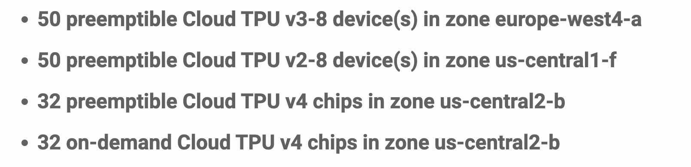

# tpu_intro

**Disclaimer: this repository is intended for personal use and is not purposed as a general guide.**

## Resources Available
<p align="center">

</p>

**Preemptible resources** are resources that the user may lose access to at any time and has a 24 hour run time limit.<br>
https://cloud.google.com/tpu/docs/preemptible

**On-demand resources** can be held by the user for as long as they wish.<br>

For both resource types, multiple TPU-VMs can be created and ran concurrently. More details about quota can be accessed at https://console.cloud.google.com/iam-admin/quotas.

## Full Commands for Using TPU-VMs

(0) Set the project id:
```
gcloud config set project ${id of the project}
```
The id of the project can be retrieved by visiting https://console.cloud.google.com/.

(1) Requesting preemptible TPU-VM:
```
gcloud compute tpus tpu-vm create example_tpu \
  --zone=${europe-west4-a, us-central1-f, or us-central2-b} \
  --accelerator-type=${tpu type, e.g., v3-8} \
  --version=tpu-ubuntu2204-base \
  --preemptible
```
to request on demand TPU-VM, remove the "--preemptible" flag.

(2) The TPU-VM request command would fail when there is no available resources. To queue for the resource:
```
# start queueing
gcloud compute tpus queued-resources create example_queue \
  --node-id=example_tpu \
  --zone=${europe-west4-a, us-central1-f, or us-central2-b} \
  --accelerator-type=${tpu type, e.g., v3-8} \
  --runtime-version=tpu-ubuntu2204-base \
  --preemptible

# check queueing status
gcloud compute tpus queued-resources describe example_queue \
  --zone=${europe-west4-a, us-central1-f, or us-central2-b}

# delete queue
gcloud compute tpus queued-resources delete example_queue --zone=${europe-west4-a, us-central1-f, or us-central2-b}
```
note that preemptible resource cannot be queued.

(3) To log in to the created TPU-VM:
```
gcloud compute tpus tpu-vm ssh example_tpu \
  --zone=${europe-west4-a, us-central1-f, or us-central2-b} \
  --ssh-key-file={e.g., ~/.ssh/google_compute_engine} \
  --worker=0
```

(4) To delete the TPU-VM:
```
gcloud compute tpus tpu-vm delete example_tpu \
  --zone=${europe-west4-a, us-central1-f, or us-central2-b}
```

(5) To use the TPU-VM with VS Code / Cursor:
Run the following to obtain the external IP of the TPU-VM:
```
gcloud compute tpus tpu-vm describe example_tpu \
  --zone=${europe-west4-a, us-central1-f, or us-central2-b}
```

Once you have the external IP, add the following to your ssh config:
```
Host the_name_does_not_matter
  User your_username
  Hostname ${the external IP of the TPU-VM}
  IdentityFile /path/to/your/ssh/file
```

## Structure of TPU-VMs

A TPU v3-8 has 4 chips, 2 cores per chip, and each core has 16GB of HBM.<br>
Typically, 4 chips are grouped as one worker. Thus, a TPU v3-32 has 4 workers, each with 4 chips and 2 cores per chip.<br>
See also https://github.com/jax-ml/jax/discussions/19927.

## Running Code on TPU-VMs
**Important notes**: a single TPU-VM can have multiple workers, and SSH'ing into a single TPU-VM worker only allows the user to make local changes to that single TPU-VM. Thus, to run commands concurrently on all workers, we need to run the following on the terminal of your local machine:
```
gcloud alpha compute tpus tpu-vm ssh example_tpu \
  --zone=${europe-west4-a, us-central1-f, or us-central2-b} \
  --ssh-key-file={e.g., ~/.ssh/google_compute_engine} \
  --worker=all \
  --command "the command you want to run"
```
the output of the command will be propagated to the terminal of your local machine.

(1) Install conda
```
gcloud alpha compute tpus tpu-vm ssh example_tpu \
--zone=${europe-west4-a, us-central1-f, or us-central2-b} \
--ssh-key-file={e.g., ~/.ssh/google_compute_engine} \
--worker=all \
--command "mkdir -p ~/miniconda3 && \
wget https://repo.anaconda.com/miniconda/Miniconda3-latest-Linux-x86_64.sh -O ~/miniconda3/miniconda.sh && \
bash ~/miniconda3/miniconda.sh -b -u -p ~/miniconda3 && \
rm ~/miniconda3/miniconda.sh && \
source ~/miniconda3/etc/profile.d/conda.sh && \
conda init"
```

(2) Scp files into the VM
```
gcloud alpha compute tpus tpu-vm scp --recurse /path/on/local/machine example_tpu:/path/on/tpu/vm \
  --zone=${europe-west4-a, us-central1-f, or us-central2-b} \
  --worker=all
```

(3) Example training scripts using multiple workers
```
gcloud alpha compute tpus tpu-vm ssh example_tpu --ssh-key-file={e.g., ~/.ssh/google_compute_engine}
--zone=${europe-west4-a, us-central1-f, or us-central2-b} \
--worker=all \
--command "cd /path/to/codebase && \
source ~/miniconda3/etc/profile.d/conda.sh && \
conda activate my_env && \
python main.py"
```
If you want to run jobs on a single worker on a TPU-VM, feel free to launch job directly on the remote worker after logging in to it.

## TPU-VM Monitoring
(1) Go to https://console.cloud.google.com/ and search "Compute Engine" in the search bar.
Then, on the left of the page, select "TPUs" under "Virtual machines". Once the list of TPUs are obtained, click into the TPU and go to the "monitoring" page.<br>
See also https://cloud.google.com/tpu/docs/troubleshooting/tpu-vm-monitoring.

(2) Use packages: https://github.com/jax-ml/jax/discussions/9756

## Data Storage
By default, each Cloud TPU VM has a single 100 GiB boot disk. To store additional data, one can use a cloud storage bucket that will be accessed remotely during model training. For other ways to store and access data, see https://cloud.google.com/tpu/docs/storage-options.

(1) To create a bucket, go to https://console.cloud.google.com/ and search "Buckets" in the search bar. Then, create a bucket in the same zone as your TPU-VM.

(2) To upload data to the bucket, run
```
gsutil -m cp -r /local/path/to/dataset gs://bucket_name/path/to/dataset
```

## Other Helpful Resources
https://cloud.google.com/tpu/docs/intro-to-tpu<br>
https://github.com/ayaka14732/tpu-starter<br>
https://jax-ml.github.io/scaling-book/