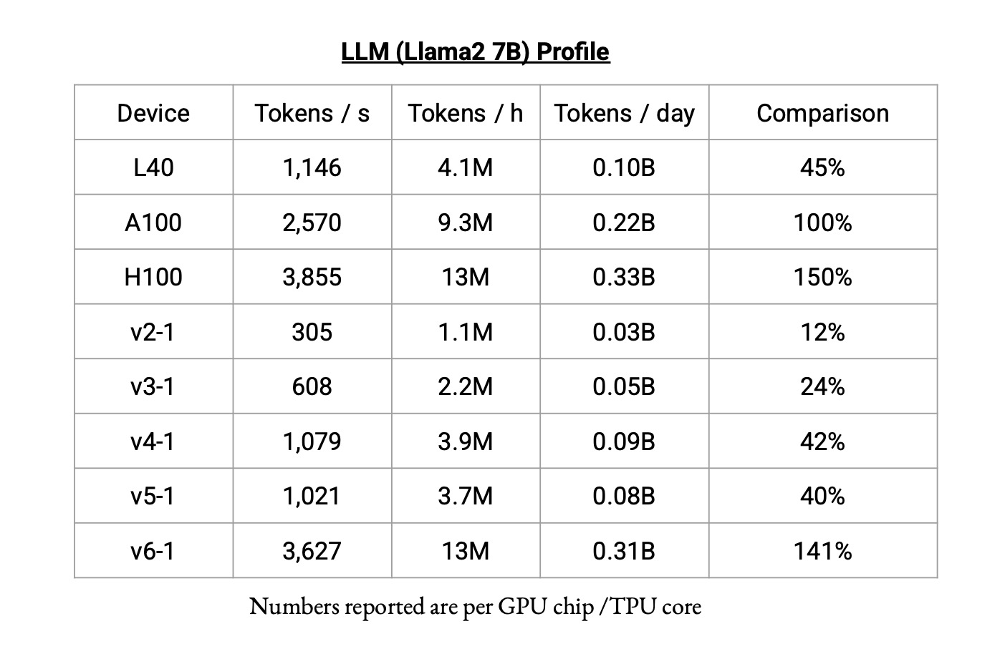

# Structure of TPUs

## (1) Configuration
|TPU version|#core per chip|#process per chip|TPU memory per process|#chips per worker (`vk-8` and above)|
|-|-|-|-|-|
|v3|2|2|16 GB|4|
|v4|2|1|32 GB|4|
|v5e|1|1|16 GB|4|
|v6e|1|1|32 GB|4|

One worker uses one external IP address. The usage of external IP address is relevant for the in-use external IP address quota.

Note that there can be 1 or 2 cores per chip. For instance, v4-64 has 64 cores, 32 chips, and 32 parallel processes.

## (2) Terminology
`vk-n`: a slice of *n* cores of TPU version *k*. For example, v4-32 is a slice of 32 cores of TPU version 4. 
`device/slice`: a single v3-8 / v4-8 / etc. is a device, whereas v4-16 / v4-64 / etc. is a (pod) slice. Note that `device` can also have other meanings in different contexts, e.g., `len(jax.devices())` gives the number of parallel workers/processes on TPU. 
`multislice`: as the name suggests, can be used to run a job on multiple separate slices. However, cases such as combining multiple v3-8 devices are not supported.

## (3) Speed (Credit: [Taiming Lu](https://taiminglu.com/))

## (4) One job per TPU-VM
For a single TPU-VM, even with multiple workers and chips, all users can only run a single job at a time. For instance, I cannot run a job on 32 cores of a v4-64 TPU-VM, and run another job on the remaining 32 cores. I also can't run two jobs (both using 64 cores) concurrently on the same v4-64 TPU-VM.

## Other Helpful Resources
https://github.com/jax-ml/jax/discussions/19927.